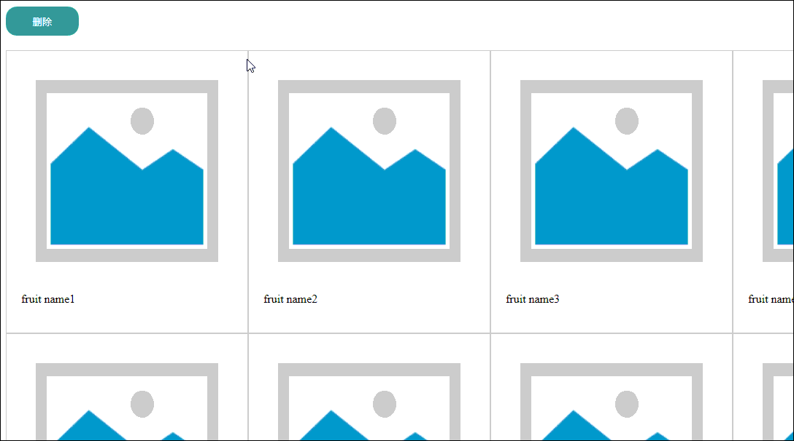

# 按钮点击删除

当点击删除时，图片上方会出现红叉，点击红叉会讲图片进行删除，点击取消会恢复原来状态，点击确认则为当前状态，并红叉消失

演示图


## 1.知识点
1) 主要就是DOM操作
```javascript
var delbtn = document.getElementsByClassName("delimg")
```
这句话是将所有的`class`为`delimg`的元素放到数组中
可以通过for来遍历

例如
```
for (var i = 0, len = delbtn.length; i < len; i++) {
    delbtn[i].style["display"] = "inline-block"
}
```

2)通过子节点获取到父节点
`node.parentNode`
通过这个，我实现了通过红叉这个节点来隐藏他的父节点
```
function del(obj) {
    console.log(obj.parentNode)
    obj.parentNode.style["display"] = "none"
}
```
